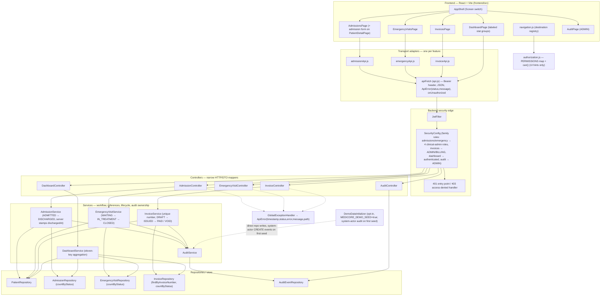

# Care-Operations Architecture

How the care-operations workflows (see `docs/care-operations.md`) are layered, with the real
component names. All claims were verified against source at the Plan 2 documentation revision
(`docs/traceability.md` maps every claim to its tests). Boundary statement: MediCore is an
educational, non-clinical training system; this document describes training-build architecture
only and makes no production-readiness claim.

## Layered flow

## Layers and their contracts

1. **UI components never call `fetch`.** Each care-operations feature owns exactly one transport
   adapter — `admissionApi.js`, `emergencyApi.js`, `invoiceApi.js` — and every adapter delegates
   to the shared `apiFetch` in `frontend/src/api.js`, the only place that adds the
   `Authorization: Bearer` header, serializes JSON, maps failures to `ApiError(status, message)`,
   and triggers `onUnauthorized` on `401`. Adapter bodies mirror the backend DTO allowlists
   exactly — for example `dischargeAdmission` can only ever send `{"status":"DISCHARGED"}`.
2. **Controllers are narrow HTTP/DTO mappers.** `AdmissionController`, `EmergencyVisitController`,
   and `InvoiceController` inject only their service — no repositories, no audit calls. Shared
   client-error mapping (404/400/409) lives in `GlobalExceptionHandler`, never in a controller.
   `DashboardController` delegates aggregation; it owns no queries.
3. **Services own workflow rules.** Creation resolves the `patientId` UUID against the patient
   repository before persisting (unknown → `NotFoundException` → 404) and trims free-text fields.
   Each service owns its lifecycle transition map and refuses every other target with
   `InvalidStateTransitionException` → 409. `InvoiceService` additionally pre-checks invoice-number
   uniqueness. Services record audit events inside the same transaction as the mutation; a failed
   operation creates neither records nor events. Transitions that the immutable entities cannot
   express as setters (admissions, emergency visits) apply one parameterized bulk update, then
   flush/clear and re-read so the response reports the true persisted state; `Invoice` exposes a
   single package-private `changeStatus` reachable only through its service's transition map.
4. **DTO allowlists are the public contract.** `CreateAdmissionRequest` accepts exactly
   `{patientId, admittedAt, reason}`, `CreateEmergencyVisitRequest` exactly
   `{patientId, arrivalAt, triageLevel, chiefComplaint}` (with `@Pattern("1|2|3|4|5")` on the
   neutral demo triage label), and `CreateInvoiceRequest` exactly
   `{patientId, invoiceNumber, amount, currency}` (non-negative, 12.2-digit `BigDecimal`,
   `[A-Z]{3}` currency). None carries a status field — the server alone sets the initial state —
   and unknown body members are never persisted. Responses (`AdmissionResponse`,
   `EmergencyVisitResponse`, `InvoiceResponse`) expose exactly their six contract fields and no
   persistence metadata (`version`, `createdAt`, `updatedAt`).
5. **Canonical String persistence is a deliberate compromise.** The legacy columns are
   String-typed, so typed request values are resolved to canonical strings at the service
   boundary — UUID strings for verified patient references, `LocalDateTime.toString()` for
   admission/emergency timestamps, `BigDecimal.toPlainString()` for amounts so exponent forms
   never reach storage or responses. This follows the Phase 1 appointment precedent and avoids a
   destructive column migration.
6. **Transition authority is server-side.** Clients can only name a target status; the service's
   transition map, not the client, decides legality, stamps `dischargedAt`, and returns the
   persisted state. The frontend permission map in `authorization.js` (and the destination
   registry in `navigation.js`) is **discoverability only**: it decides what the interface offers,
   never what a request may do. `SecurityConfig` is the authority — family rules give
   `/api/admissions/**` and `/api/emergency-visits/**` to ADMIN, DOCTOR, NURSE, and RECEPTIONIST;
   `/api/invoices/**` to ADMIN and BILLING only; `/api/dashboard/**` to any authenticated role;
   `/api/audit/**` to ADMIN. UI hiding plus server enforcement are pinned together by
   `SecurityAuthorizationTest` and `authorization.test.js`.
7. **Error mapping has one owner.** `GlobalExceptionHandler` (`@RestControllerAdvice`) maps
   `NotFoundException` → 404, `InvalidStateTransitionException` → 409 (controlled client-safe
   message, no cause), duplicate/integrity violations → 409 (cause-free messages pass through;
   Spring-translated DB violations get a fixed generic conflict message so SQL internals never
   leak), `MethodArgumentNotValidException` → 400 field summary, malformed path values → 400, and
   malformed bodies (bad JSON, non-UUID reference, unparseable date/time) → 400 "Malformed request
   body". The security edge produces `401`/`403` before controllers, with their own compact bodies.
8. **Audit is exactly-once and side-effect-owned by services.** Every successful mutation writes
   exactly one `AuditEvent` (`actor`, `action`, `resourceType`, `resourceId`, `details`,
   `occurredAt`) with the acting session user, and `details` names the transition
   (e.g. `status: DISCHARGED`). Pinned by
   `CareOperationsApiTest.careOperationsAuditSweepPinsExactlyOneEventCanonicalDetailsAndNoSensitiveLeakage`
   and the per-family create/transition/delete tests; the RBAC tests additionally prove a `403`
   attempt persists no record and records no event. The ADMIN `AuditPage` renders only the five
   evidence columns — never `details` payloads, persistence metadata, tokens, or request bodies.
9. **Dashboard aggregation is owned by `DashboardService`.** The service issues five whole-table
   counts plus status-bucket counts through derived repository queries (`countByStatus`), emits
   the eleven contract keys in a fixed insertion order, and is strictly read-only — no audit
   events, no caching, no date windows. `DashboardApiTest` pins the exact key set including
   all-zero status counts on fresh data and side-effect-freedom; `DashboardPage.test.jsx` pins the
   labeled frontend groups and the generic fallback for unknown keys.

## Known structural limits (honest)

- **Legacy String columns** remain for admissions, emergency visits, and invoices (canonical
  strings for new rows). No schema migration exists in this milestone.
- **`admittedAt`/`arrivalAt` are stored as canonical strings**, not SQL timestamp columns; only
  create accepts them and no edit path changes them.
- **The discharge/transition bulk update** bypasses JPA optimistic-lock `version` increments by
  design (the entities are intentionally immutable); concurrent conflicting transitions are still
  serialized by the transaction and the pre-checked current state.
- **Beds (`/api/beds`) stay raw entity CRUD** with unverified string references — explicitly out
  of scope for this phase and documented as such in `docs/api.md`.
- **Dashboard is twelve count queries per request.** A recorded standing decision in
  `docs/performance.md` keeps it unchanged without new measured evidence.
- **Single-workstation, single-process baseline:** no caching layer, no horizontal scaling, no
  external integrations, no payment rails — by design and by boundary.
