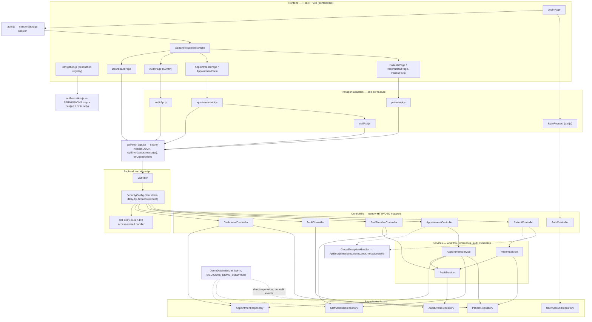

# Patient Journey Architecture

How the demonstrated workflow (see `docs/patient-journey.md`) is layered, with the real component names. All claims were verified against source at commit `6595c03`.

## Boundary statement

MediCore is an educational, non-clinical training system. This document describes training-build architecture only and makes no production-readiness claim.

## Layered flow

## Layers and their contracts

1. **UI components never call `fetch`.** Each feature owns exactly one transport adapter — `patientApi.js`, `appointmentApi.js`, `staffApi.js`, `auditApi.js` — and login goes through `loginRequest`. Every adapter delegates to the shared `apiFetch` in `frontend/src/api.js`, which is the only place that adds the `Authorization: Bearer` header, serializes JSON, maps failures to `ApiError(status, message)`, and triggers the `onUnauthorized` callback on `401`.
2. **Controllers are narrow HTTP/DTO mappers.** `PatientController` and `AppointmentController` inject only their service — no repositories, no audit calls. `StaffMemberController` and `AuditController` are thin repository reads/writes with audit at the controller boundary; `DashboardController` is five count queries.
3. **Services own workflow rules.** `AppointmentService` resolves the patient then the professional (`NotFoundException` → 404) before persisting, stores canonical UUID-string references, and records audit events inside the same transaction (class-level `@Transactional`; reads are `@Transactional(readOnly = true)`). `PatientService` records CREATE/UPDATE events for its mutations. A failed validation creates neither records nor audit events.
4. **Repositories are Spring Data JPA** over H2 (local profile) or PostgreSQL (later `postgres` profile). Entities never serialize to HTTP — responses are immutable DTO records (`PatientDtos.PatientResponse`, `AppointmentDtos.AppointmentResponse`, `StaffMemberDtos.StaffMemberResponse`) that exclude persistence internals (`version`, `createdAt`, `updatedAt`).
5. **Audit is application-level.** `AuditService.record(action, type, id, details)` derives the actor from `SecurityContextHolder` and stores an `AuditEvent` (actor, action, resourceType, resourceId, details, occurredAt). The `AuditController` exposes it read-only to `ADMIN`.

## RBAC enforcement — two layers, one authority

| Layer | Component | Nature |
|---|---|---|
| UI capability hints | `frontend/src/authorization.js` — `PERMISSIONS` map + `can(session, action, resource)`, consumed by `navigation.js` and all feature screens | Convenience only. Deny-by-default for unknown resources/actions, missing sessions, or empty role lists. Decides what the interface *offers*. |
| Server enforcement (authoritative) | `SecurityConfig` request rules, ordered: public (`/api/auth/**`, `/actuator/health`) → method-level write rules → family rules → `ADMIN`-only catch-all for unmatched `/api/**` → `anyRequest().authenticated()` | Decides what any request *may do*. `401` from the authentication entry point, `403` from the access-denied handler. |

The enforced journey matrix (pinned by `SecurityAuthorizationTest`):

| Action | ADMIN | DOCTOR | NURSE | RECEPTIONIST | Other (e.g. BILLING) |
|---|---|---|---|---|---|
| `GET /api/patients`, `GET /api/patients/{id}` | 2xx | 2xx | 2xx | 2xx | 403 |
| `POST /api/patients` | 2xx | 403 | 403 | 2xx | 403 |
| `PUT /api/patients/{id}` | 2xx | 403 | 403 | 2xx | 403 |
| `GET /api/appointments` | 2xx | 2xx | 2xx | 2xx | 403 |
| `POST /api/appointments` | 2xx | 403 | 403 | 2xx | 403 |
| `GET /api/staff` | 2xx | 403 | 403 | 2xx | 403 |
| staff/dept/shift writes (`/api/staff/**`, `/api/departments/**`, `/api/shifts/**`) | 2xx | 403 | 403 | 403 (HR: 2xx) | 403 |
| `GET /api/audit` | 2xx | 403 | 403 | 403 | 403 |
| `GET /api/dashboard` | 2xx | 2xx | 2xx | 2xx | 2xx (any authenticated) |

Method-level rules for patient create/update and appointment create are ordered **before** the four-role family rules, so no implemented write action depends solely on frontend hiding — the plan's Task 9 completion gate, enforced in `SecurityConfig` and pinned by the `…EnforcesAdminReceptionistOnlyWrites` tests.

## Error contract path

- `401` (no/expired session): `SecurityConfig` entry point → `{"error":"authentication required"}`. The frontend `apiFetch` invokes `onUnauthorized`, the shell returns to Login, and no local error is stacked.
- `403` (role refused): `SecurityConfig` access-denied handler → `{"error":"access denied"}`. The UI renders the shared permission-denial message. (The raw handler body differs from the `ApiError` shape by design — it is produced before controllers.)
- Rejected login: `AuthController`'s controller-scoped handler → `401` `{"error":"Invalid username or password."}` (uniform, non-enumerating).
- `400`/`404` client errors: `GlobalExceptionHandler` (`@RestControllerAdvice`) is the single owner, always emitting the stable `ApiError` JSON shape: `{"timestamp","status","error","message","path"}`. It maps `NotFoundException` → 404, `MethodArgumentNotValidException` → 400 field summary, `MethodArgumentTypeMismatchException` → 400, `HttpMessageNotReadableException` → 400 "Malformed request body".

## Known structural limits (honest)

- Duplicate medical record numbers are prevented only by the `patients.medical_record_number` unique constraint — `PatientService.create` has no pre-check and `GlobalExceptionHandler` has no integrity-violation handler, so a real duplicate may surface as `500` instead of `400`/`409`.
- `Appointments` reference columns remain Strings (canonical UUID strings for new rows; legacy pre-Task-4 rows keep raw values read-only). No schema migration exists in this milestone.
- The demo seeder writes through repositories, bypassing services — seeded rows carry no audit events (intentional and documented).
- Professional availability/eligibility rules do not exist in the `StaffMember` model; selection only.
- Single-workstation, single-process baseline: no caching layer, no horizontal scaling, no external integrations.
